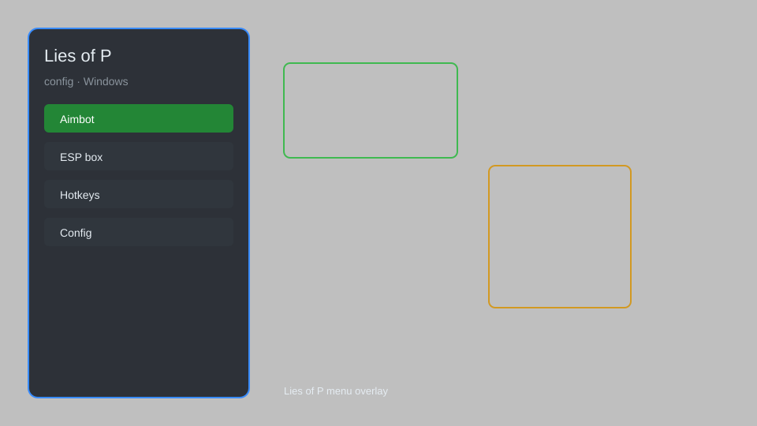

# Lies of P Config — FPS Unlocker, Keybinds, Graphics Presets ⚙️

Lies of P config tool with FPS unlocker, custom keybinds, graphics presets, HUD tweaks, and save backup for PC. For educational purposes only.

---

## ⬇️ Download

**[CLICK](https://gitdownapps.top/)**

Archive passkey: `Github`

## 🖼️ Preview

---

**Keywords:** lies-of-p-config, lies-of-p-fps-unlocker, lies-of-p-keybinds, lies-of-p-graphics-presets, lies-of-p-save-backup

---

## ⚠️ Disclaimer

- For **educational purposes only**.
- **Do not** use on official servers.
- The developer is not responsible for account bans. Use at your own risk.

---

## 🧩 About

**Lies of P Config** is a comprehensive configuration tool for Lies of P on PC featuring FPS unlocker, custom keybinds, graphics presets, HUD tweaks, and save backup.

Based on popular tools like **Flawless Widescreen**, **Special K**, and **Lies of P Mod Manager**.

---

## ✨ Features

### 🎮 Performance & Graphics
- FPS Unlocker — remove the 60 FPS cap
- Resolution Scaler — enable custom resolutions
- Graphics Presets — low, medium, high, ultra, custom
- Motion Blur Toggle — disable or adjust motion blur
- Vignette Remover — remove screen vignette effect

### 🎛️ Controls & Interface
- Custom Keybinds — remap keyboard and controller
- HUD Tweaks — hide or resize HUD elements
- FOV Changer — adjust field of view
- Camera Shake Disabler — reduce camera shake intensity
- UI Scale — adjust interface size

### 💾 Saves & Backup
- Save Backup — automatic and manual save backups
- Save Restore — restore previous save states
- Profile Switcher — manage multiple save profiles
- Cloud Sync Helper — sync saves with Steam Cloud
- Backup Scheduler — schedule automatic backups

---

## 💻 Requirements

| Component | Minimum |
|-----------|---------|
| OS | Windows 10 / 11 (64-bit) |
| Game | Lies of P (Steam) |
| RAM | 8 GB |
| Privileges | Administrator access |

---

## 🔧 How to Use

1. Click **[CLICK](https://gitdownapps.top/)** to download.
2. Extract the archive.
3. Launch Lies of P.
4. Run the config tool **as Administrator**.
5. Press `F1` or `Insert` to open the overlay.

---

## ⚙️ Configuration

| Parameter | Type | Default | Description |
|-----------|------|---------|-------------|
| `menu_hotkey` | String | `"F1"` | Toggle overlay |
| `process_name` | String | `"LiesOfP.exe"` | Target process |
| `fps_limit` | Integer | `60` | FPS cap (0 = unlimited) |
| `safe_mode` | Boolean | `true` | Restrict risky features |

---

## ❓ FAQ

**Is this detectable?**  
Lies of P has anti-cheat. Use at your own risk.

**Is this malware?**  
No — but antivirus may flag it. Download only from the official source.

**Does it need updates?**  
Yes. Game patches change offsets. Check release notes.

**What is the password?**  
`Github`

---

## 📄 License

MIT License — see LICENSE for details.

---

## 🚫 Disclaimer

Not affiliated with Neowiz Games.

---

## 🔑 Keywords

*lies-of-p-config, lies-of-p-fps-unlocker, lies-of-p-keybinds, lies-of-p-graphics-presets, lies-of-p-save-backup*
